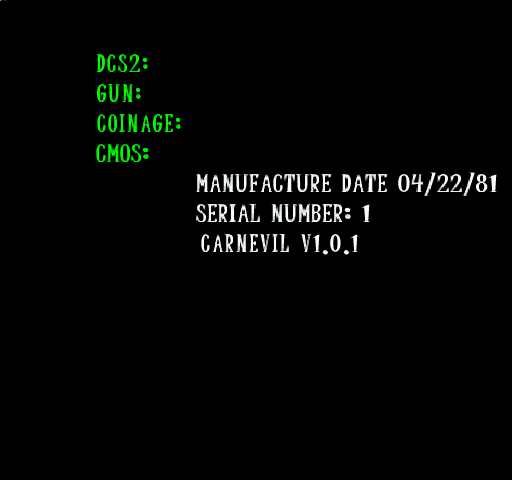

# CarnEvil Static Recompilation

```
     ██████╗ █████╗ ██████╗ ███╗   ██╗███████╗██╗   ██╗██╗██╗
    ██╔════╝██╔══██╗██╔══██╗████╗  ██║██╔════╝██║   ██║██║██║
    ██║     ███████║██████╔╝██╔██╗ ██║█████╗  ██║   ██║██║██║
    ██║     ██╔══██║██╔══██╗██║╚██╗██║██╔══╝  ╚██╗ ██╔╝██║██║
    ╚██████╗██║  ██║██║  ██║██║ ╚████║███████╗ ╚████╔╝ ██║███████╗
     ╚═════╝╚═╝  ╚═╝╚═╝  ╚═╝╚═╝  ╚═══╝╚══════╝  ╚═══╝  ╚═╝╚══════╝

        "Step right up! Don't be shy! Everybody's gonna DIE!"
```

**Tearing apart Midway's 1998 horror-themed light gun arcade classic and putting it back together for modern hardware.**

CarnEvil was a coin-op rail shooter where you blasted your way through a haunted amusement park full of undead clowns, evil toys, and a giant eyeball boss named Eyeclops. It ran on Midway's Seattle arcade board -- a MIPS R5000 CPU bolted to a 3DFX Voodoo 1 GPU. The goal: statically recompile the game's MIPS binary into native C/C++ so it runs on a modern PC without emulation.

## Hardware Target

| Component | Spec |
|-----------|------|
| **CPU** | MIPS R5000LE @ 150 MHz (MIPS-IV ISA) |
| **RAM** | 8 MB DRAM @ 0x80000000 (kseg0) |
| **GPU** | 3DFX Voodoo 1 -- FBI (2MB framebuffer) + TMU (4MB texture) |
| **Sound** | DCS2 -- ADSP-2115 @ 16 MHz, 2MB DRAM, DCS 3.0 compressed audio |
| **Storage** | IDE hard drive, custom "TRAP" / Phoenix filesystem |
| **I/O** | Midway IOASIC (shuffled register mode), analog lightguns, PIC security |
| **Display** | 512x384 @ 57 Hz |

Source: [System16 Hardware Page](https://www.system16.com/hardware.php?id=618)

## Current Status: Readable Text On Screen + 3D Pipeline Validated

The game boots and runs cleanly with zero crashes, the full RTOS / state-machine
/ callback / task plumbing works, and the renderer now puts **legible text on
screen** -- the system-info screen draws **"CARNEVIL V1.0.1"**, "SERIAL NUMBER",
"MANUFACTURE DATE", and the green DCS2/GUN/COINAGE/CMOS labels:



Since the entity-render breakthrough, four more layers came online: **font/texture
binding** (text is readable), the **per-frame zone parser** (was wedged on
command 0), and a **validated 3D triangle pipeline** (depth + perspective). The
software Voodoo now correctly samples the AI88 font, runs perspective-correct
texturing with a Z-buffer, and emits depth-tested 3D triangles end-to-end.

The one thing still missing is a **solid 3D model** on screen -- and that turned
out to be an *asset* problem, not an engine one (see "The Model Wall" below).

### What's Working

- **2,500+ recompiled MIPS functions** (2,196 game + 304 RTOS + manual overrides) running as native x64
- **Full RTOS emulation** -- 27 vector table trampolines, device callbacks (VEC[60]/[64]), 15+ fiber task scheduler (Windows fibers) with channel-6 event dispatch, frame-done + per-slot callbacks
- **Complete boot sequence**: RTOS banner -> env config -> diagnostics -> CMOS -> DCS2 handshake -> free play -> **normal attract mode** (NVRAM audit subsystem made read/write-consistent so the readiness check passes)
- **On-screen text rendering** -- the UI/glyph path renders legibly. The font is **AI88** (texMode fmt 13: 16-bit/texel, 256 texels = 512-byte rows); four fixes got glyphs from flat boxes to text: grouped iterated-register layout (S@`0xDC`/T@`0xE8`/W@`0xF4`), tex-enable gated on S/T gradients (not texBase), 2-byte AI88 stride, and a per-glyph vertical T un-flip.
- **Validated 3D triangle path** -- `sub_800D2654` (the depth-tested + textured + Gouraud emitter, vertex layout `{x,y,W,S,T,Z,R,G,B}`) renders a correctly-positioned depth+perspective triangle, confirming the Voodoo handles real 3D geometry, not just 2D overlays.
- **Per-frame zone parser** -- the attract zone-command parser (`func_8010FE90`) advances through its command stream each frame and loads intro assets (was a total no-op: it bailed on the DCS-ready gate `dword_802122E0 & 0x10000`, and the per-frame scene re-run kept resetting the config pointer to command 0).
- **Proper pixel pipeline** -- Gouraud vertex-colour interpolation, 8-function Z-buffer, perspective-correct texture sampling, all gated on the game's own mode registers
- **Entity dispatch** fires every frame; the long black-screen blocker (an uninitialised `ctx->f_odd`) is resolved
- **Yield-escape via setjmp/longjmp**, **DCS-ready event simulation**, **callback stack fix** (valid 4 KB stack at `0x807EF000`)
- **Voodoo double-buffered emulation**: LFB writes, FastFill, SwapBuffers, AI88/RGB565 texture sampling from TMU memory
- **Device I/O**: DCS2 (`0x69XX`), IOASIC (`0x74XX`), PIC handshake; CMOS/NVRAM; PCI config bridge; heap snapshot/restore

### The Model Wall (why there's no solid 3D model yet)

The 3D *render pipeline* is proven, but a real model still won't draw -- because
this disk's **model assets don't match the executable**. Fully mapped this
session:

- The pipeline is loader `sub_800CA724` (.ZM) -> drawer `sub_800DFF38` (T&L
  `sub_800CEFBC` + mesh walk `sub_800E1EF0`) -> emitter `sub_800D2654`.
- The on-disk `BABY.ZM` decodes as **942 vertex positions + 946 normals + 1706
  face records** -- but the face records carry per-vertex S/T and **no vertex
  indices** (an exhaustive scan finds zero index records anywhere in the file),
  so the surface topology is unrecoverable. The companion `baby.za` is **animation**
  (15 frames x 685 records), not topology.
- **Every model file's CRC mismatches** the value baked into `GAME.EXE`
  (BABY.ZM wants `0x6F51D615`, has `0xA84325BF`; baby.za wants `0xA05090DA`, has
  `0x80FF99D0`; PUKE.ZM mismatches too). The CRC algorithm is verified correct
  (reproduces the CRC-32/MPEG-2 reference); no byte-order / init / length-append
  variant matches -- so the **data** differs, even though `GAME.bin` is
  byte-exact from this same image (`== diskGAME.EXE[0x208:]`).

Conclusion: the CHD's model asset set is a **different build** than `GAME.EXE`
expects (stale baked CRCs / different revision). We *can* decode and render the
real vertex positions as a point cloud through the validated 3D path
(`docs/baby_zm_decoded_pointcloud.png`), but a solid model needs CRC/format-
matching assets from a different dump.

### What's Next

- [x] **Entity dispatch + first geometry** -- DONE (root cause: uninitialised `ctx->f_odd`).
- [x] **Full Voodoo triangle setup** -- DONE. Gouraud, Z-buffer, perspective texturing.
- [x] **Texture/font binding** -- DONE. AI88 font renders legible on-screen text.
- [x] **Per-frame attract progression** -- DONE (partial). Zone parser advances each frame; intro assets load.
- [x] **3D model render pipeline** -- DONE (validated via a hand-fed triangle + decoded vertex cloud); blocked only on matching assets.
- [ ] **Solid 3D model on screen** -- blocked on asset sourcing: find a CarnEvil dump whose `.ZM`/`.za` files CRC-match this `GAME.EXE`.
- [ ] **Modern GPU Backend** -- Replace software Voodoo with Vulkan/OpenGL.
- [ ] **DCS2 Audio** -- ADSP-2115 DSP or direct DCS 3.0 audio bank decoding.
- [ ] **Input System** -- Mouse/gamepad/Sinden lightgun, networked 2P co-op.

### Recent Milestones (this branch)

| Commit | What it unlocked |
|--------|------------------|
| `19a3505` | **Readable text** -- bind the AI88 font texture (fixed register layout, AI88 2-byte stride, per-glyph T un-flip) |
| `fc08f35` | **Per-frame zone parser** -- unblock zone-config parsing (DCS gate + decouple setup from per-frame re-run) |
| `875311d` | **3D pipeline validated** -- depth-tested + perspective triangle via `sub_800D2654`; model-render scaffold |
| `b83c9a8` | **Model decode** -- decode disk `BABY.ZM`, render its vertex positions as a point cloud (surface blocked on assets) |
| `a6dbba0` | Entity geometry renders for the first time (invoke entry `+0x10`) |
| `073df58` | Initialise `ctx->f_odd` -- fixes the render-path crash (clean frames) |
| `ca672d0` | NVRAM audit-read identified -> game reaches **normal** attract mode |
| `22fb9bd` | Fix `voodoo_write` clobbering registers / firing commands on memory writes |

## Architecture

```
carnevil/
├── tools/                     Extraction & analysis tools
│   ├── chd_extract.py         CHD v5 -> raw disk image
│   ├── seattle_fs.py          TRAP/Phoenix filesystem extractor
│   ├── make_elf.py            Flat MIPS binary -> ELF (for Ghidra/IDA)
│   └── analyze_*.py           Binary analysis scripts
├── src/runtime/               Hardware runtime shims
│   ├── seattle_runtime.c      Main runtime: memory map, MMIO, frame loop
│   ├── seattle_overrides.c    Function overrides for RTOS/game functions
│   ├── voodoo.c/h             3DFX Voodoo 1 register emulation + FastFill
│   ├── rtos_scheduler.c/h     Cooperative fiber scheduler (Windows fibers)
│   ├── rtos_trampolines.c     27 vector table -> RTOS function redirects
│   ├── rtos_stubs.c           RTOS function stubs + callback system
│   ├── rtos_registration.c    304 RTOS function registrations
│   ├── input.c/h              Input system (mouse/gamepad/lightgun)
│   ├── dcs_sound.c/h          DCS2 audio stubs
│   └── recomp.h               Recompiled code support macros
├── recomp_out/                N64Recomp output (recompiled C code)
│   ├── funcs/                 2,187 game functions
│   └── rtos_funcs/            304 RTOS functions
├── extracted/                 Extracted game data
│   ├── GAME.bin/elf           Game binary (914 KB, loads at 0x800C4000)
│   ├── RTOS.bin/elf           RTOS binary (89 KB, loads at 0x80000000)
│   ├── cmos_nvram.bin         CMOS/NVRAM from MAME
│   └── files/                 1,361 game assets
├── carnevil_syms.toml         Game symbol file (2,044 functions)
├── rtos_syms.toml             RTOS symbol file (317 functions)
├── carnevil_recomp.toml       Game recompilation config
├── rtos_recomp.toml           RTOS recompilation config
└── CMakeLists.txt             Build configuration
```

## Building

```bash
mkdir build && cd build
cmake ..
cmake --build . --config Release
```

Requires: MSVC 2022+, CMake 3.20+, game ROM files (not included)

## Function Naming Pipeline

The recompiler names functions from `carnevil_syms.toml`. A tooling pipeline
derives meaningful names from Ghidra analysis so generated code reads
`main_init_sound(...)` instead of `func_800C5E30(...)`:

```bash
# 1. Export Ghidra analysis (functions/symbols/decompiled JSON; string xrefs)
analyzeHeadless.bat <proj> carnevil-game -process GAME.elf -noanalysis \
  -postScript tools/ghidra_export_analysis.py -scriptPath tools
# 2. Derive names (self-naming debug strings + descriptive slugs + RE seed list)
python tools/derive_names.py            # -> ghidra_export/name_map.json
# 3. Apply to syms (skips the 64 src/runtime-overridden funcs)
python tools/merge_names_to_syms.py
# 4. After a regen, keep registration consistent with the new names
python tools/gen_func_registration.py   # -> src/runtime/func_registration.inc
```

The biggest naming signal is CarnEvil's own debug strings, many of which contain
the function name (`coin_volume_proc():`, `sst1InitSli`, `snd_load_bank`). Names
keep an `_ADDR8` suffix for uniqueness and round-trip traceability. Steps 1-3 are
inert until the next regen (the C++ build doesn't read syms).

## Why Static Recompilation?

MAME emulates CarnEvil already, but emulation has overhead and limitations. Static recompilation converts the original MIPS machine code directly into equivalent C code that compiles natively. The result runs at full speed without a CPU interpreter, and the translated code can be understood, modified, and enhanced.

The Midway Seattle platform is a great target:
- **Simple CPU** -- MIPS-IV is clean and regular
- **Small binary** -- ~1.7MB of code+data
- **Known hardware** -- MAME has fully documented every chip
- **Debug strings** -- Function names and error messages baked in
- **3DFX Voodoo** -- Well-documented register interface
- **Shared RTOS** -- "Mother GOOSE" RTOS used by ALL Seattle games (Wayne Gretzky, Mace, Blitz, California Speed, Hyperdrive, etc.)

## Related Projects

- **[pcrecomp](https://github.com/sp00nznet/pcrecomp)** -- Our unified x86 PC recompilation toolbox
- **[N64Recomp](https://github.com/N64Recomp/N64Recomp)** -- MIPS static recompilation for N64 by Mr-Wiseguy

## Requirements

- MSVC 2022+ (Windows) or GCC/Clang (Linux, untested)
- CMake 3.20+
- Python 3.10+ with `soundfile`, `numpy` (for extraction tools)
- Game ROM files (not included)

## License

MIT

---

*Built with stubbornness, quarters, and the lingering trauma of Tokkentakker by [sp00nznet](https://github.com/sp00nznet)*
