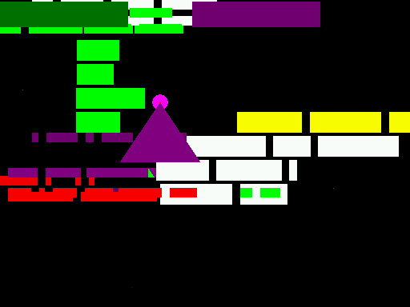

# CarnEvil Static Recompilation

```
     ██████╗ █████╗ ██████╗ ███╗   ██╗███████╗██╗   ██╗██╗██╗
    ██╔════╝██╔══██╗██╔══██╗████╗  ██║██╔════╝██║   ██║██║██║
    ██║     ███████║██████╔╝██╔██╗ ██║█████╗  ██║   ██║██║██║
    ██║     ██╔══██║██╔══██╗██║╚██╗██║██╔══╝  ╚██╗ ██╔╝██║██║
    ╚██████╗██║  ██║██║  ██║██║ ╚████║███████╗ ╚████╔╝ ██║███████╗
     ╚═════╝╚═╝  ╚═╝╚═╝  ╚═╝╚═╝  ╚═══╝╚══════╝  ╚═══╝  ╚═╝╚══════╝

        "Step right up! Don't be shy! Everybody's gonna DIE!"
```

**Tearing apart Midway's 1998 horror-themed light gun arcade classic and putting it back together for modern hardware.**

CarnEvil was a coin-op rail shooter where you blasted your way through a haunted amusement park full of undead clowns, evil toys, and a giant eyeball boss named Eyeclops. It ran on Midway's Seattle arcade board -- a MIPS R5000 CPU bolted to a 3DFX Voodoo 1 GPU. The goal: statically recompile the game's MIPS binary into native C/C++ so it runs on a modern PC without emulation.

## Hardware Target

| Component | Spec |
|-----------|------|
| **CPU** | MIPS R5000LE @ 150 MHz (MIPS-IV ISA) |
| **RAM** | 8 MB DRAM @ 0x80000000 (kseg0) |
| **GPU** | 3DFX Voodoo 1 -- FBI (2MB framebuffer) + TMU (4MB texture) |
| **Sound** | DCS2 -- ADSP-2115 @ 16 MHz, 2MB DRAM, DCS 3.0 compressed audio |
| **Storage** | IDE hard drive, custom "TRAP" / Phoenix filesystem |
| **I/O** | Midway IOASIC (shuffled register mode), analog lightguns, PIC security |
| **Display** | 512x384 @ 57 Hz |

Source: [System16 Hardware Page](https://www.system16.com/hardware.php?id=618)

## Current Status: Entity Render Works -- Real Game Geometry On Screen

The game boots and runs **500/500 frames cleanly with zero crashes**, the full
RTOS / state-machine / callback / task plumbing works, entity dispatch fires
every frame, and **real CarnEvil attract-mode geometry renders to the
framebuffer** (~3000 Voodoo swaps, ~26% non-black):



The entity-dispatch blocker that kept the screen black for many sessions is
resolved. The chain of fixes: escape the attract-mode init barrier so the frame
loop runs -> **initialise `ctx->f_odd`** (the recompiler's odd-FPU-register
pointer was never set, so the first odd-float access in the render handler
NULL-deref'd -- this was the real crash) -> fix the FTRIANGLE vertex decode (the
game stores float vertices at regs `0x88-0x9C`, not the `0x180+` slots the
decoder read). With those, the full pipeline runs end-to-end: RTOS -> attract
state machine -> entity dispatch -> DMA -> Voodoo -> rasterizer -> framebuffer.

The rasterizer is now a proper **pixel pipeline**: Gouraud vertex-colour
interpolation (SRED/SGREEN/SBLUE), an 8-function Z-buffer, and perspective-
correct texture sampling -- each gated on the game's own mode registers. The
current attract content is flat-shaded UI/text (the game leaves iterated colour,
depth, and texturing disabled for it); those paths engage for the textured 3D
scene, which real attract reaches around frame ~3000.

### What's Working

- **2,500+ recompiled MIPS functions** (2,196 game + 304 RTOS + manual overrides) running as native x64
- **Full RTOS emulation** -- 27 vector table trampolines, device callbacks (VEC[60]/[64]), 15+ fiber task scheduler (Windows fibers) with channel-6 event dispatch, frame-done + per-slot callbacks
- **Complete boot sequence**: RTOS banner -> env config -> diagnostics -> CMOS -> DCS2 handshake -> free play -> attract mode
- **State-machine dispatcher** walks the full doubly-linked mode-entry list (5 registered modes, all dispatched per frame; previously only the first was called)
- **Callback infrastructure** -- slot 1-4 callbacks all fire per frame after late-enable; VEC[64] vblank callbacks active; frame-done callback active
- **Attract mode lifecycle** completes cleanly: `func_800C50AC` init -> camera update (`func_800CAE2C`) -> scene funcs (`func_800CAFD0`/`AF24`/`CB19C`/`CB31C`) all return with sensible yield counts
- **Yield-escape via setjmp/longjmp** -- mode functions with infinite yield-loops (fiber-resume mid-entries like `func_800C6D08`, `func_800C78E4`, `func_800E79C0`) now return cleanly after a threshold of yields
- **DCS-ready event simulation** -- `0x001DDDE0 |= 0x4` set conditionally during yield-escape (not preemptively), letting attract scene funcs progress past their wait-loops without breaking new poll loops elsewhere
- **Callback stack fix** -- `rtos_run_callbacks` now sets up a valid 4 KB stack at `0x807EF000`; previously `cb_ctx.r29 = 0` corrupted callee-saved registers across calls (silently dropped stack saves landed in the I/O sink)
- **Zone file I/O**: vec[18] copies BABY.ZM (90 KB), baby.za (246 KB) into heap buffers; zone command parser advances ~38 commands during attract
- **Voodoo double-buffered emulation**: LFB writes to back buffer, FastFill, SwapBuffers copy, ~423K register writes total per run
- **LFB/Register separation**: physical `0x00800000+` = framebuffer pixels, `0x08100000+` = Voodoo registers
- **Widget board registers**: return proper 512x384 video config with render-enable bits
- **Device I/O**: DCS2 (`0x69XX`), IOASIC (`0x74XX`), PIC commands with proper handshake responses
- **Heap management** with per-frame snapshot/restore
- **PCI configuration space bridge**, CMOS/NVRAM, DMA buffer allocation

### Known Gaps (Why It's Still Black)

| Layer | State |
|-------|-------|
| Scene graph `0x0017B71C` | **Empty** (`sg_head=0`) |
| `func_800D7600` (scene-node create) | **0 invocations / 500 frames** |
| 14 entity-draw functions in `0x80100000+` | **0 invocations / 500 frames** |
| `func_80167848` (DMA triangle submit) | 14 calls during PCI init, 0 per frame |
| Per-frame Voodoo writes | All state writes (`fbzMode`, `fastfillCMD`, `swapbufferCMD`); no `triangleCMD` |

So the entire **state pipeline** works (config, channel signaling, fastfill, swap), but **no geometry pipeline runs** because no scene nodes ever get created.

### What's Next

- [x] **Identify the entity-dispatch trigger** -- DONE. Entity dispatch fires per frame; geometry reaches the Voodoo. (Root cause of the long black-screen was an uninitialised `ctx->f_odd`, not the dispatch path itself.)
- [x] **Fiber-resume support for split entries** -- DONE (optional path). `attract_fiber.{c,h}` runs the attract state machine `func_800C50AC` as a per-frame-resumed Windows fiber with proper event_wait blocking; gated behind `g_use_attract_fiber` (default off, escape path is the default).
- [x] **Full Voodoo triangle setup** -- DONE. Gouraud vertex-colour interpolation (`SRED`/`SGREEN`/`SBLUE`), 8-function Z-buffer, perspective-correct texture sampling, all gated on the game's mode registers. Gouraud verified; alpha blending still TODO.
- [ ] **Texture upload** -- texture *sampling* is implemented (TMU writes captured into texmem), but the game's texture-download path isn't exercised in the 500-frame attract window (no textures uploaded yet). Drive attract to the textured 3D scene (or find the upload path) to light it up.
- [ ] **Modern GPU Backend** -- Replace software Voodoo with Vulkan/OpenGL.
- [ ] **DCS2 Audio** -- ADSP-2115 DSP or direct DCS 3.0 audio bank decoding.
- [ ] **Input System** -- Mouse/gamepad/Sinden lightgun, networked 2P co-op.

### Recent Milestones (this branch)

| Commit | What it unlocked |
|--------|------------------|
| `71fd80e` | sp-corruption fix -- `rtos_run_callbacks` no longer drops callee-saved register saves |
| `9aa787a` | Removed placeholder test-fixture scene nodes that were masking the real state |
| `8e92d20` | State-machine dispatcher walks the full 5-mode list (was only calling 1) |
| `fe44da0` | Re-recompiled 3 missing split-entry mode functions (added to `carnevil_syms.toml`) |
| `e1dbb9e` | Yield-escape via `setjmp`/`longjmp` -- fiber-resume mid-entries now run without spinning |
| `74b0759` | Proper DCS-ready event simulation -- attract scene funcs complete cleanly |
| `4eef3f3` | Implemented edge-function triangle rasterizer + vertex-register storage fix -- pixels now actually render when triangles arrive |

## Architecture

```
carnevil/
├── tools/                     Extraction & analysis tools
│   ├── chd_extract.py         CHD v5 -> raw disk image
│   ├── seattle_fs.py          TRAP/Phoenix filesystem extractor
│   ├── make_elf.py            Flat MIPS binary -> ELF (for Ghidra/IDA)
│   └── analyze_*.py           Binary analysis scripts
├── src/runtime/               Hardware runtime shims
│   ├── seattle_runtime.c      Main runtime: memory map, MMIO, frame loop
│   ├── seattle_overrides.c    Function overrides for RTOS/game functions
│   ├── voodoo.c/h             3DFX Voodoo 1 register emulation + FastFill
│   ├── rtos_scheduler.c/h     Cooperative fiber scheduler (Windows fibers)
│   ├── rtos_trampolines.c     27 vector table -> RTOS function redirects
│   ├── rtos_stubs.c           RTOS function stubs + callback system
│   ├── rtos_registration.c    304 RTOS function registrations
│   ├── input.c/h              Input system (mouse/gamepad/lightgun)
│   ├── dcs_sound.c/h          DCS2 audio stubs
│   └── recomp.h               Recompiled code support macros
├── recomp_out/                N64Recomp output (recompiled C code)
│   ├── funcs/                 2,187 game functions
│   └── rtos_funcs/            304 RTOS functions
├── extracted/                 Extracted game data
│   ├── GAME.bin/elf           Game binary (914 KB, loads at 0x800C4000)
│   ├── RTOS.bin/elf           RTOS binary (89 KB, loads at 0x80000000)
│   ├── cmos_nvram.bin         CMOS/NVRAM from MAME
│   └── files/                 1,361 game assets
├── carnevil_syms.toml         Game symbol file (2,044 functions)
├── rtos_syms.toml             RTOS symbol file (317 functions)
├── carnevil_recomp.toml       Game recompilation config
├── rtos_recomp.toml           RTOS recompilation config
└── CMakeLists.txt             Build configuration
```

## Building

```bash
mkdir build && cd build
cmake ..
cmake --build . --config Release
```

Requires: MSVC 2022+, CMake 3.20+, game ROM files (not included)

## Function Naming Pipeline

The recompiler names functions from `carnevil_syms.toml`. A tooling pipeline
derives meaningful names from Ghidra analysis so generated code reads
`main_init_sound(...)` instead of `func_800C5E30(...)`:

```bash
# 1. Export Ghidra analysis (functions/symbols/decompiled JSON; string xrefs)
analyzeHeadless.bat <proj> carnevil-game -process GAME.elf -noanalysis \
  -postScript tools/ghidra_export_analysis.py -scriptPath tools
# 2. Derive names (self-naming debug strings + descriptive slugs + RE seed list)
python tools/derive_names.py            # -> ghidra_export/name_map.json
# 3. Apply to syms (skips the 64 src/runtime-overridden funcs)
python tools/merge_names_to_syms.py
# 4. After a regen, keep registration consistent with the new names
python tools/gen_func_registration.py   # -> src/runtime/func_registration.inc
```

The biggest naming signal is CarnEvil's own debug strings, many of which contain
the function name (`coin_volume_proc():`, `sst1InitSli`, `snd_load_bank`). Names
keep an `_ADDR8` suffix for uniqueness and round-trip traceability. Steps 1-3 are
inert until the next regen (the C++ build doesn't read syms).

## Why Static Recompilation?

MAME emulates CarnEvil already, but emulation has overhead and limitations. Static recompilation converts the original MIPS machine code directly into equivalent C code that compiles natively. The result runs at full speed without a CPU interpreter, and the translated code can be understood, modified, and enhanced.

The Midway Seattle platform is a great target:
- **Simple CPU** -- MIPS-IV is clean and regular
- **Small binary** -- ~1.7MB of code+data
- **Known hardware** -- MAME has fully documented every chip
- **Debug strings** -- Function names and error messages baked in
- **3DFX Voodoo** -- Well-documented register interface
- **Shared RTOS** -- "Mother GOOSE" RTOS used by ALL Seattle games (Wayne Gretzky, Mace, Blitz, California Speed, Hyperdrive, etc.)

## Related Projects

- **[pcrecomp](https://github.com/sp00nznet/pcrecomp)** -- Our unified x86 PC recompilation toolbox
- **[N64Recomp](https://github.com/N64Recomp/N64Recomp)** -- MIPS static recompilation for N64 by Mr-Wiseguy

## Requirements

- MSVC 2022+ (Windows) or GCC/Clang (Linux, untested)
- CMake 3.20+
- Python 3.10+ with `soundfile`, `numpy` (for extraction tools)
- Game ROM files (not included)

## License

MIT

---

*Built with stubbornness, quarters, and the lingering trauma of Tokkentakker by [sp00nznet](https://github.com/sp00nznet)*
